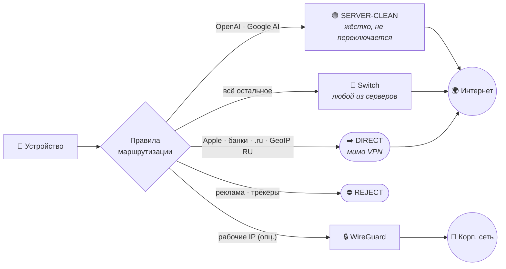
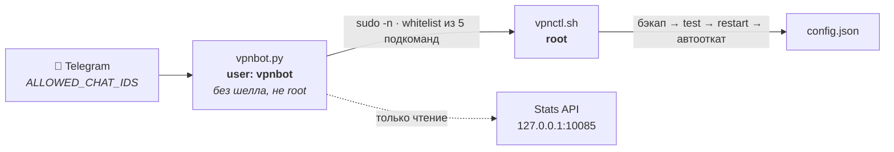

<div align="center">

# 🛡️ tunnel-kit

**Свой VPN для РФ на VLESS + Reality с раздельным туннелированием.**

Обход DPI/ТСПУ и доступ к ChatGPT/Google — при этом App Store, банки и РФ-ресурсы идут напрямую.


</div>

---

## 🚀 С чего начать

Выбери один путь — они взаимозаменяемы, не нужно делать всё сразу.

| | Путь | Что открыть | Сколько займёт |
|---|------|-------------|----------------|
| 🤖 | **Есть ИИ-агент с доступом к терминалу** | **[ai-setup-prompt.md](ai-setup-prompt.md)** — заполняешь пару полей, даёшь SSH, агент делает всё сам | ~15 мин |
| 🔧 | **Хочу понять и сделать руками** | **[xray-vpn-deployment-guide.md](xray-vpn-deployment-guide.md)** — подробная пошаговая инструкция | ~1 час |
| ⚡ | **Уже работает, хочу больше** | **[optional-enhancements.md](optional-enhancements.md)** — подписка, мониторинг, учёт трафика, Telegram-бот, роутер | по желанию |

<details>
<summary><b>📑 Оглавление</b></summary>

- [Как устроен трафик](#-как-устроен-трафик)
- [Ключевой урок: выбор хостера решает всё](#-ключевой-урок-выбор-хостера-решает-всё)
- [Сервер за 3 команды](#-сервер-за-3-команды)
- [Клиент с раздельным туннелированием](#-клиент-с-раздельным-туннелированием)
- [Что можно добавить сверху](#-что-можно-добавить-сверху)
- [Структура репозитория](#-структура-репозитория)
- [Чек-лист после установки](#-чек-лист-после-установки)
- [Ротация ключей](#-ротация-ключей-если-ссылку-могли-увидеть)
- [Словарь терминов](#-словарь-терминов)
- [Безопасность и дисклеймер](#-безопасность-и-дисклеймер)

</details>

---

## 🔀 Как устроен трафик

Смысл всей затеи: **не гнать через VPN всё подряд**. Российские сервисы ломаются от зарубежного IP, а AI-сервисы — наоборот, требуют «чистый» не-российский ASN.



| Трафик | Куда | Почему так |
|--------|------|------------|
| OpenAI, Google/Gemini | `SERVER-CLEAN` | им нужен не-российский ASN, и переключать этот узел нельзя |
| Apple/App Store, РФ-банки, `.ru`, GeoIP RU | **DIRECT** | с зарубежного IP они ломаются или просят подтверждений |
| Выбранные IP/сети *(опц.)* | отдельный WireGuard | рабочие/корпоративные ресурсы |
| Реклама, трекеры | **REJECT** | бонусом |
| Всё остальное | группа `Switch` | переключение сервера в один тап |

---

## 🎯 Ключевой урок: выбор хостера решает всё

> [!IMPORTANT]
> OpenAI и Google блокируют не по стране на карте, а по **ASN/геобазе IP**. Российский хостер — даже с сервером физически в Амстердаме — отдаёт `error_code: unsupported_country`, потому что его автономная система помечена как RU. Cloudflare при этом может показывать `loc=NL`; не ориентируйся на него.

- ✅ Бери **не-российский** хостер: DigitalOcean, Vultr, Contabo, OVH. Локация NL/DE/FI.
- ❌ Избегай российских хостеров с зарубежными локациями — для AI не заработает.
- 💡 Бери с почасовой оплатой: если IP окажется в блок-листе, пересоздай сервер и получи новый.

**Проверка «чистоты» IP до настройки:**

```bash
ssh root@SERVER_IP 'curl -4 -s https://chatgpt.com/cdn-cgi/trace | grep -E "^(ip|loc)="; \
  curl -4 -s -o /dev/null -w "aistudio: %{http_code}\n" -L https://aistudio.google.com/'
```

`loc` должен совпасть с реальной страной сервера, aistudio — отдать `200`.

---

## ⚙️ Сервер за 3 команды

```bash
# 1. Установить xray
bash -c "$(curl -L https://github.com/XTLS/Xray-install/raw/main/install-release.sh)" @ install

# 2. Сгенерировать ключи
xray uuid           # -> UUID
xray x25519         # -> PrivateKey / Password(PublicKey)
openssl rand -hex 8 # -> shortId
```

Дальше — `/usr/local/etc/xray/config.json`: VLESS + Reality + `flow: xtls-rprx-vision`, `dest`/`serverNames` на **проверенный** TLS 1.3-сайт и `outbound.freedom.domainStrategy = UseIPv4`. Полный шаблон — в [гайде](xray-vpn-deployment-guide.md).

<details>
<summary><b>⚠️ Выбор Reality-<code>dest</code>: где все спотыкаются</b></summary>

<br>

TLS 1.3 сам по себе **не гарантия** — Reality должен уметь «одолжить» хендшейк сайта.

| Статус | Домен | Причина |
|--------|-------|---------|
| ✅ | `www.samsung.com` | проверен, не за Cloudflare |
| ✅ | `dl.google.com` | проверен |
| ✅ | `addons.mozilla.org` | проверен |
| ✅ | `www.nvidia.com` | проверен |
| ❌ | `www.microsoft.com` | TLS 1.3 есть, но хендшейк не одалживается → клиент падает в fallback |
| ❌ | `*.cloudflare.com`, `discord.com` | за Cloudflare — ТСПУ его троттлит |
| ❌ | `google.com`, любые `.ru` | слишком заметно |

После настройки **обязательно** проверь реальным клиентом, что трафик идёт через сервер, а не падает в fallback на `dest`: подними временный xray-клиент и сделай `curl ifconfig.me` через socks — должен вернуться IP твоего сервера.

</details>

<details>
<summary><b>🔐 Минимальный хардненинг</b></summary>

<br>

BBR + TCP Fast Open, `ufw` (22 + 443), `fail2ban`, `unattended-upgrades`, SSH только по ключу.

Готовые команды и cloud-init — в [xray-vpn-deployment-guide.md](xray-vpn-deployment-guide.md), разделы 3 и 12.

</details>

---

## 📱 Клиент с раздельным туннелированием

1. Добавь узлы по vless-ссылкам. Имя узла (после `#`) должно совпадать с именем в конфиге — напр. `SERVER-CLEAN`, `SERVER-ALT`.
2. Скопируй [shadowrocket.conf.example](shadowrocket.conf.example) в свой `.conf`, подставь значения.
3. Импортируй конфиг, поставь Global Routing = **Config**.
4. Группа **Switch** переключает сервер для обычного трафика; AI-домены жёстко на `SERVER-CLEAN`.

> [!TIP]
> Переезжаешь с телефона на роутер? Правила Shadowrocket и маршруты WireGuard конвертируются скриптами — см. [раздел 8](optional-enhancements.md#8-перенос-на-роутер-xkeen). Там же две ловушки XKeen, которые выглядят как «всё настроено, но глючит».

---

## ⚡ Что можно добавить сверху

Каждое — независимо и необязательно. Подробности и команды: **[optional-enhancements.md](optional-enhancements.md)**.

| | Улучшение | Что даёт |
|---|-----------|----------|
| 📡 | [Подписка](optional-enhancements.md#1-subscription-сервер) | узлы обновляются на всех устройствах сами |
| 💚 | [Мониторинг + авто-восстановление](optional-enhancements.md#2-мониторинг--авто-восстановление) | сам чинит упавший сервис, ведёт лог |
| 🔔 | [Telegram-алерты](optional-enhancements.md#3-telegram-алерты) | 🟢 ок · 🟡 авто-починка · 🔴 критично |
| 🔗 | [Кросс-серверный чек туннеля](optional-enhancements.md#4-сквозной-кросс-серверный-чек-туннеля) | ловит поломку Reality, которую сервисный чек не видит |
| 💾 | [Бэкап конфигов](optional-enhancements.md#5-бэкап-конфигов) | пересобрать сервер за минуты |
| 📊 | [Учёт трафика по пользователям](optional-enhancements.md#6-учёт-трафика-по-пользователям) | видно, кто сколько съел; алерт до овереджа хостера |
| 🤖 | [Интерактивный Telegram-бот](optional-enhancements.md#7-интерактивный-telegram-бот) | управление сервером из чата, без SSH |
| 🏠 | [Перенос на роутер (XKeen)](optional-enhancements.md#8-перенос-на-роутер-xkeen) | VPN для всей домашней сети |

<details>
<summary><b>🤖 Что умеет бот и почему он не работает под root</b></summary>

<br>

**Команды:**

| Группа | Команды |
|--------|---------|
| Инфо | `/status` · `/traffic` · `/day` · `/month` · `/users` · `/top` |
| Доступ | `/link` · `/qr` · `/adduser` · `/deluser` · `/quota` |
| Операции | `/restart` · `/logs` · `/backup` |

**Граница привилегий.** Бот — обычный процесс без прав, а не root-демон с токеном в чате:



- `/etc/sudoers.d/vpnbot` — фиксированный whitelist из пяти подкоманд, никакого `NOPASSWD: ALL`. Файл проверяется `visudo -c` **до** установки.
- Токен в `/etc/vpnbot/bot.conf` (600, владелец `vpnbot`), а не в `/root` — каталог `/root` закрыт правами 700 на уровне каталога.
- Пустой `ALLOWED_CHAT_IDS` = бот не отвечает никому.
- Каждая правка `config.json` идёт через бэкап → `xray run -test` → рестарт → проверка `:443` → автооткат при провале.

</details>

---

## 📂 Структура репозитория

| Файл | Назначение |
|------|-----------|
| [`README.md`](README.md) | этот обзор |
| [`ai-setup-prompt.md`](ai-setup-prompt.md) | чек-лист + промпт: отдаёшь ИИ-агенту с SSH — настраивает под ключ |
| [`xray-vpn-deployment-guide.md`](xray-vpn-deployment-guide.md) | подробная серверная инструкция (руками) |
| [`optional-enhancements.md`](optional-enhancements.md) | 9 необязательных апгрейдов: от подписки до роутера |
| [`shadowrocket.conf.example`](shadowrocket.conf.example) | шаблон клиентского конфига (без секретов) |
| [`ru-direct.list`](ru-direct.list) | пример списка РФ-доменов для DIRECT |
| [`scripts/`](scripts/) | 13 готовых скриптов — см. таблицу ниже |

<details>
<summary><b>📜 Что лежит в <code>scripts/</code></b></summary>

<br>

| Скрипт | Где запускать | Что делает |
|--------|---------------|------------|
| [`vpn-healthcheck.sh`](scripts/vpn-healthcheck.sh) | сервер | проверка + авто-починка каждые 5 мин, алерты 3 уровней |
| [`tunnel-check.sh`](scripts/tunnel-check.sh) | сервер | сквозной чек туннеля до соседнего сервера |
| [`setup-telegram-alert.sh`](scripts/setup-telegram-alert.sh) | сервер | находит chat_id и включает алерты |
| [`backup-config.sh`](scripts/backup-config.sh) | сервер | один архив для пересборки сервера |
| [`enable-xray-stats.sh`](scripts/enable-xray-stats.sh) | сервер | Stats API + email-теги клиентам (идемпотентно, с автооткатом) |
| [`vpn-usage-collect.sh`](scripts/vpn-usage-collect.sh) | сервер | копит per-user трафик помесячно, сверяет с личными квотами |
| [`vpn-traffic-alert.sh`](scripts/vpn-traffic-alert.sh) | сервер | пороги 80/95% квоты хостера, `--report` · `--digest` · `--monthly` |
| [`install-traffic-monitor.sh`](scripts/install-traffic-monitor.sh) | сервер | ставит учёт трафика тремя таймерами |
| [`vpnbot.py`](scripts/vpnbot.py) | сервер | Telegram-бот, только stdlib, под непривилегированным юзером |
| [`vpnctl.sh`](scripts/vpnctl.sh) | сервер | единственная точка привилегированных мутаций для бота |
| [`install-vpn-bot.sh`](scripts/install-vpn-bot.sh) | сервер | ставит бота, sudoers-whitelist и systemd-юнит |
| [`shadowrocket-to-xray.py`](scripts/shadowrocket-to-xray.py) | локально | правила Shadowrocket → routing для Xray/XKeen |
| [`wg-conf-to-routes.py`](scripts/wg-conf-to-routes.py) | локально | WireGuard `.conf` → статические маршруты роутера |

</details>

> [!NOTE]
> Реальные конфиги (`*.conf`), `vpn-credentials.md`, QR и ключи — в `.gitignore` и в репозиторий не попадают.

---

## ✅ Чек-лист после установки

- [ ] `systemctl is-active xray` → `active`
- [ ] порт `443` слушается: `ss -tln | grep :443`
- [ ] клиент подключился, `curl ifconfig.me` через VPN отдаёт **IP сервера**
- [ ] `https://chatgpt.com/cdn-cgi/trace` через VPN показывает `loc` страны сервера, не `RU`
- [ ] РФ-сайт и банковское приложение открываются (значит DIRECT работает)
- [ ] после `reboot` всё поднялось само: `systemctl is-active xray caddy vpn-healthcheck.timer`
- [ ] `pre-commit install` выполнен — коммит с ключом будет заблокирован

---

## 🔄 Ротация ключей (если ссылку могли увидеть)

Сервер пересоздавать не нужно — ключи меняются за пару минут:

```bash
# на сервере
NEW=$(xray x25519)                       # новый privateKey + Password(PublicKey)
NEWSID=$(openssl rand -hex 8)            # новый shortId
# впиши новый privateKey и shortId в /usr/local/etc/xray/config.json
xray -test -config /usr/local/etc/xray/config.json && systemctl restart xray
```

Затем собери новую vless-ссылку с новым `pbk` (Password) и `sid`, обнови узел в клиенте. Старая ссылка сразу перестанет работать.

---

## 📖 Словарь терминов

<details>
<summary><b>Развернуть, если термины незнакомы</b></summary>

<br>

| Термин | Что это |
|--------|---------|
| **VLESS** | протокол прокси — «транспорт» твоего трафика до сервера |
| **Reality** | маскировка: для цензора соединение выглядит как обычный визит на чужой большой сайт |
| **XTLS-Vision** (`flow`) | ускоритель поверх Reality, меньше накладных расходов на HTTPS |
| **ТСПУ / DPI** | оборудование глубокого анализа трафика у провайдеров РФ, ищет и режет VPN |
| **ASN** | «сеть-владелец» IP-адреса; по нему OpenAI/Google определяют страну |
| **dest / SNI** | имя сайта, под который маскируется Reality (TLS 1.3, не за Cloudflare) |
| **shortId / pbk** | параметры Reality в ссылке; `pbk` — публичный ключ, его можно передавать |
| **DoH** | DNS поверх HTTPS, чтобы провайдер не подменял ответы |
| **XKeen** | сборка Xray для роутеров Keenetic/Netcraze поверх Entware |

</details>

> В промпте и конфиге менять нужно только **IP сервера** и **путь к SSH-ключу** — остальные значения рабочие, оставляй как есть.

---

## 🔒 Безопасность и дисклеймер

- [`.pre-commit-config.yaml`](.pre-commit-config.yaml) включает секрет-сканер **gitleaks**. Поставь один раз — и коммит с ключом или токеном будет заблокирован:

  ```bash
  brew install pre-commit && pre-commit install
  ```

- Ключи, vless-ссылки и URL подписки = доступ к твоему VPN. Не публикуй их; если утекли — [ротация](#-ротация-ключей-если-ссылку-могли-увидеть) занимает пару минут.
- Бэкап-архив содержит приватные ключи и токен бота — держи его только на сервере (права 600).

> **Дисклеймер.** Материал для законного обеспечения приватности и доступа к легальным сервисам. Соблюдай законы своей юрисдикции. Ключи и конфиги — только твои, не публикуй их.
